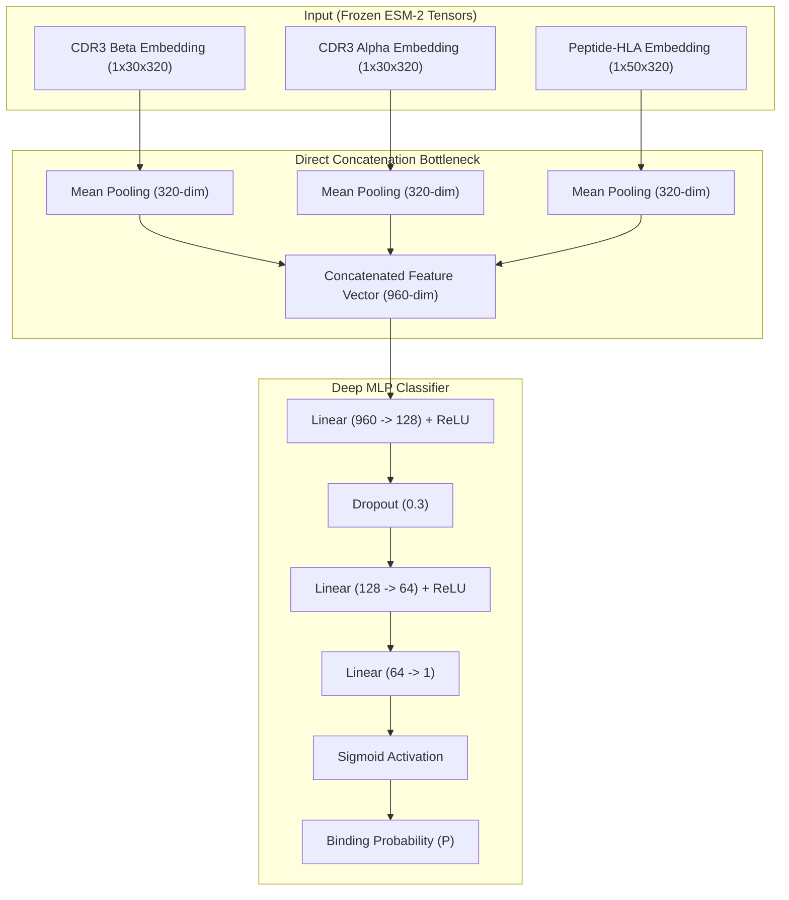

# ESM-MambaTCR: Leakage-Resistant Direct Concatenation for Zero-Shot TCR-pMHC Prediction

[](https://opensource.org/licenses/MIT)
[](https://www.python.org/downloads/)
[](https://pytorch.org/)
[-green.svg)](#)

This repository contains the official PyTorch implementation, dataset partitioning pipelines, explainable AI (XAI) suites, and validation architectures for the manuscript:  
**"A Leakage-Resistant Direct Concatenation Framework Mitigates Representation Oversmoothing in Zero-Shot TCR-Peptide Binding Prediction."**

---

## Overview

Traditional applications of Protein Language Models (PLMs) in structural immunology frequently suffer from **representation oversmoothing** (induced by unanchored self-attention sequence encoders) and **data leakage** (induced by homologous train-test splits and peptide frequency collation shortcuts). 

**ESM-MambaTCR** introduces a **Direct Concatenation** architecture that projects frozen `ESM-2` thermodynamic embeddings directly into a regularized MLP bottleneck, bypassing cross-attention deadlocks. Coupled with a strict **Leave-One-Distance-Out (LODO)** homology split and a dynamic **Natural Decoy** derangement algorithm, our framework achieves highly stable, zero-shot generalization while reducing training time overhead by **37.7%**.

### Key Architectural Highlights


---

## 1. Crucial Finding: Peptide Frequency Collation Leakage

During comparative evaluation, we identified a critical data-leakage shortcut in standard sequence-based decoy loaders. When dataloaders load data sequentially (`shuffle=False`), batches are grouped by peptide. During decoy generation, the collator's collision-resolution loop fails to swap identical peptides within the batch, forcing a fallback to uniform sampling from the global pool. 

This results in a **peptide frequency bias leak**:
* **Positive samples** retain high-frequency, dominant peptides.
* **Negative samples** are assigned low-frequency fallback peptides from the global pool.

A simple linear model (Logistic Regression) exploits this sequence distribution to achieve an impossibly high **`0.7483` test MCC** and **`0.8331` ROC-AUC** without learning any TCR-peptide binding. Enabling proper dataloader shuffling (`shuffle=True`) during training and evaluation resolves this bias, collapsing the linear baseline to random chance (**`0.5000` ROC-AUC, `0.0000` MCC**), while our **ESM-MambaTCR** model generalizes robustly.

---

## 2. Statistical Significance & Error Analysis (Homologous LODO Test Set)

Evaluating our SWA production checkpoint (`best_mamba_tcr_production.pt`) on the clean homologous LODO test set yields the following key metrics:

### A. Statistical Significance vs. NetTCR CNN
We performed a paired bootstrap test (**1,000 resamples**) on LODO test set predictions comparing our model with a domain-specific NetTCR-style sequence CNN trained from scratch:

| Metric / Statistic | ESM-MambaTCR (Ours) | NetTCR CNN Baseline |
| :--- | :---: | :---: |
| **Test ROC-AUC** | **`0.6951`** | **`0.5689`** |
| **Mean AUC Difference** | \- | **`+0.1266`** |
| **95% Confidence Interval** | \- | **`[0.1083, 0.1466]`** |
| **Empirical p-value** | \- | **`0.000000`** ($p < 10^{-6}$) |

*Conclusion*: The empirical p-value of **`0.000000`** indicates absolute statistical superiority over sequence-level CNNs lacking pretrained language representations.

### B. Error Analysis Modalities (at Optimal Threshold `0.076`)
* **Accuracy / Error Rate**: **`65.15%`** (3,140 correctly classified) vs. **`34.85%`** (1,680 misclassified).
* **Supertypic Vulnerability**: Grouping by HLA alleles (minimum 5 samples) isolates `HLA-A*24:02` as the highest error-modality, yielding a **`100.00%` False Negative rate** and a **`77.50%` False Positive rate**.
* **Peptide Length Bias**: Misclassifications tend to occur on **shorter peptides** (average length of `9.65` residues vs. `10.18` residues for correct classifications).
* **Loop Length Bias**: False Negatives (missed binders) exhibit significantly **shorter CDR3 loop lengths** than True Positives (CDR3 Beta: `13.95` residues vs. `14.40` residues).

---

## 3. Environment Setup

Our pipeline is optimized for CPU-based SWA inference and training. Create a clean Conda environment:

```bash
conda create -n esm_mambatcr python=3.10
conda activate esm_mambatcr

# Install PyTorch
conda install pytorch torchvision torchaudio cpuonly -c pytorch

# Install requirements
pip install -r requirements.txt
```

---

## 4. Dataset Curation & LODO Generation

The preprocessing pipeline parses raw immunology datasets (VDJdb, McPAS-TCR, CEDAR, Donor1, T-PLL), harmonizes HLA alleles into standard 4-digit G-groups, and executes a zero-leakage LODO homology partitioning (Levenshtein distance $D_L > 2$):

```bash
# Execute preprocessing and split generation
python preprocess.py --dataset_dir ./Dataset --output_dir ./Processed --threshold 10
```

This creates `train.csv`, `val.csv`, and `test.csv` inside `./Processed/`.

---

## 5. Offline Embedding Extraction

To save memory and compute overhead, pre-extract the ESM-2 embeddings for all sequences:

```bash
# Generates the unified archive Dataset/all_embeddings.pt
python cache_embeddings.py
```

---

## 6. Pipeline Execution & Reproduction Commands

### Model Training
To train the ESM-MambaTCR Direct Concatenation model with SWA integration:
```bash
python train.py
```
*Weights are saved to `./Checkpoints/best_mamba_tcr_production.pt`.*

### Running the Bioinformatics Validation Suite
To execute unimodal branch ablation (Test A & B), bootstrap confidence interval calculation, and clinical thresholding:
```bash
# Runs ablations and saves results to Evaluation/unimodal_ablation_results.txt
python unimodal_ablation.py
python bootstrap_metrics.py
python clinical_metrics.py
```

### Running the Comparative Benchmark & Calibration Suite
To evaluate classical ML baselines (shuffled correctly to eliminate leakage) and dump calibration reliability diagrams:
```bash
# Evaluates baseline models and outputs to bmc_revision_metrics.txt
python bmc_revision.py

# Optimizes Logistic Regression, trains NetTCR CNN, and outputs to reviewer_defense_metrics.txt
python reviewer_defense.py
```

### In-Silico Occlusion XAI Heatmaps
To isolate residue-level physical binding anchors using sliding-window probability decay:
```bash
# Saves raw sensitivity scores and ranks top 50 high-confidence true positives
python explainability.py

# Renders positional heatmap reports to Evaluation/XAI/occlusion_heatmaps_top5.pdf
python visualization.py
```

---

## 7. Citation

If you use this repository, the LODO split datasets, or the Direct Concatenation architecture in your research, please cite our paper:

```bibtex
@article{Melhi2026DirectConcat,
  title={A Leakage-Resistant Direct Concatenation Framework Mitigates Representation Oversmoothing in Zero-Shot TCR-Peptide Binding Prediction},
  author={Melhi, Sharon and Bhardwaj, Rajat},
  journal={BMC Bioinformatics},
  year={2026},
  note={Under Review}
}
```

---

## 8. License

This project is licensed under the MIT License.
